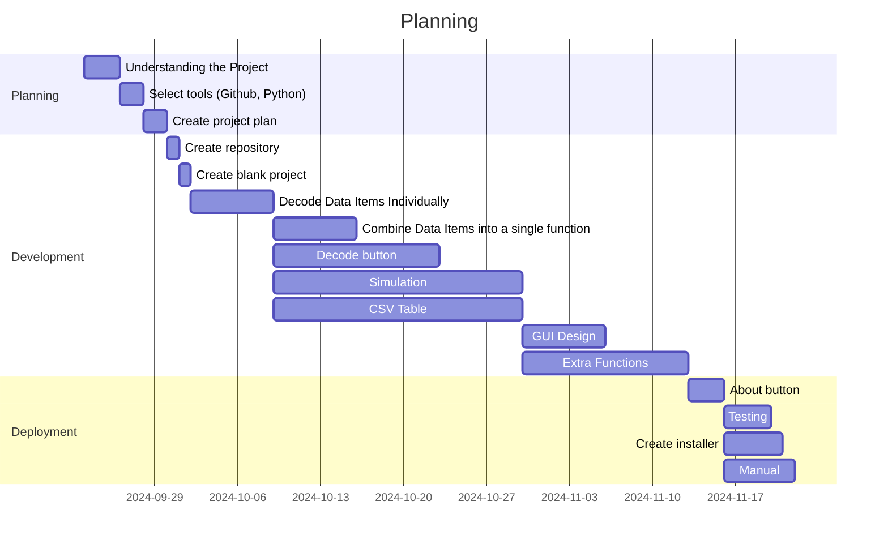
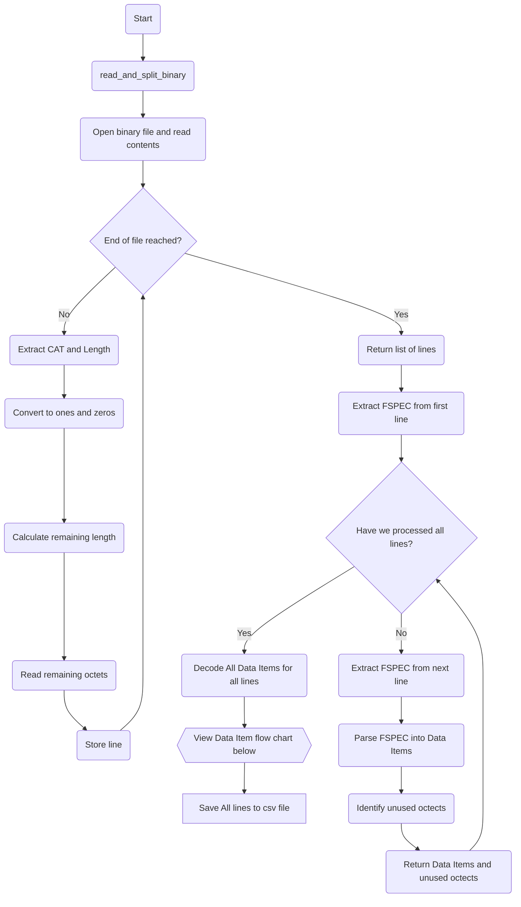

# AsterixProject
To view the App Manual open the application and click on Help --> Manual

## Overview of Project
We have developed the following planning:

The tasks have been divided among the group members as follows:

## Code Structure
For the decoding of each data item we have created a function that decodes the bits of each Data Item according to CAT 048. This is all done in the function `convert_to_csv`. First we convert the Asterix Binary to 1s and 0s and separate each message into a line. Then we get the FSPEC structure of each line as it can be seen below:

A function to extract the data corresponding to a Data Item was made for each Data Item. They take the Octets of information correspoding to the length of that specific data item as input and as an output have the corresponding data, SAC, SIC, Time of Day, etc. 

So after we have the FSPECS, we start decoding each Data Item. If a specific Data Item is present according to the FSPEC, then we call the correspoding function and extract the data. This is the overall logic:

```mermaid
flowchart TD
    R(Process Data Item)
    R --> Q{Is Data Item 010 Present?}
    Q --> |Yes |S(Extract SAC and SIC and add to CSV line with function get_sac_sic)
    S -->T
    Q --> |No| T{Is Data Item 140 Present?}
    T --> |Yes| U(Extract Time of Day and add to CSV line with function get_time_of_day)
    U --> V
    T --> |No| V{Is Data Item 020 Present?}
    V --> |Yes| V1(Extract Target Report Descriptor and add to csv line with function get_target_report_descriptor)
    V1 --> V2
    V --> |No| V2{Is Data Item 040 Present?}
    V2 --> |Yes| V3(Extract Measured Posotion in Polar and add to csv line with function get_measured_position_in_slant_coordinates)
    V3 --> V4
    V2 --> |No| V4{Is Data Item 070 Present?}
    V4 --> |Yes| V5(Extract Mode 3A Data and add to csv line with get_mode3a_code)
    V5 --> V6
    V4 --> |No| V6{Is Data Item 090 Present?}
    V6 --> |Yes| V7(Extract FL and add to csv line with get_flight_level)
    V7 --> V8
    V6 --> |No| V8{Is Data Item 130 Present?}
    V8 --> |Yes| V9(Extract Radar Plot Characteristics and add to csv line with function get_radar_plot_characteristics)
    V9 --> V10
    V8 --> |No| V10{Is Data Item 220 Present?}
    V10 --> |Yes| V11(Extract Aircraft Address and add to csv line with function get_aircraft_address)
    V11--> V12
    V10 --> |No| V12{Is Data Item 240 Present?}
    V12 --> |Yes| V13(Extract Aircraft Identification and add to csv line with function get_aircraft_identification)
    V13 --> V14
    V12 --> |No| V14{Is Data Item 250 Present?}
    V14 --> |Yes| V15(Extract Mode S MB Data and add to csv line with function get_mode_s_mb_data)
    V15 --> V16(Correct Mode C if necessary)
    V16 --> V17(Correct flight level if necessary)
    V17 --> V18(Convert Polar Coordinates to Cartesian Coordinates with function polar_to_cartesian)
    V18 --> V19(Convert Cartesian Coordinates to Geocentric Coordinates with function cartesian_to_geocentric)
    V19 --> V20(Convert Geocentric Coordinates to Geodesic Coordinates function geocentric_to_geodesic)
    V20 --> V21(Add Geodesic coordinates to csv line)
    V21 --> V22
    V14 --> V22{Is Data Item 161 Present?}
    V22 --> |Yes|V23(Extract Track Number and add data to csv line with function get_track_number)
    V23 --> V24
    V22 --> |No|V24{Is Data Item 042 Present?}
    V24 --> |Yes| V25(Extract Cartesian Coordinates and add to csv line with function get_track_number)
    V25 --> V26
    V24 --> |No| V26{Is Data Item 200 Present?}
    V26 --> |Yes| V27(Extract Velocity and add to csv line with function get_calculated_track_velocity)
    V27 --> V28
    V26 --> |No| V28{Is Data Item 170 Present?}
    V28 --> |Yes| V29(Extract Track Status and add to csv line with function get_track_status)
    V29 --> V30
    V28 --> |No| V30{Is Data Item 210 Present?}
    V30 --> |Yes| V31(Account for space)
    V31 --> V32
    V30 --> |No| V32{Is Data Item 030 Present?}
    V32 --> |Yes| V33(Account for space)
    V33 --> V34
    V32 --> |No| V34{Is Data Item 080 Present?}
    V34 --> |Yes| V35(Account for space)
    V35 --> V36
    V34 --> |No| V36{Is Data Item 100 Present?}
    V36 --> |Yes| V37(Account for space)
    V37 --> V38 
    V36 --> |No| V38{Is Data Item 110 Present?}
    V38 --> |Yes| V39(Extract Heigth Measured by 3D Radar and add to csv line with function get_height_measured)
    V39 --> V40
    V38 --> |No| V40{Is Data Item 120 Present?}
    V40 --> |Yes| V41(Account for Space)
    V41 --> V42
    V40 --> |No| V42{Is Data Item 230 Present?}
    V42 --> |Yes| V43(Extract Data and add to csv line with function get_comms)
    V43 --> V44
    V42 --> |No| V44{Is this the last line?}
    V44 --> |Yes| V45{{Exit}}
    V44 --> |No| V46(Next Line)
    V46 --> Q
```

Finally, all lines are saved to the csv file.

## For Developers
### First time installing Project
1. Clone repo: `git clone https://github.com/Robertguarneros/AsterixProject.git`
2. Change into the project directory 
3. Install the dependencies: `pip install -r requirements.txt`
4. Run proyect

### Project Structure

The source code of the project is organized as follows:

- `assets`: contains logo and images used.
- `App.py`: entry point of the app, also where all the GUI menu elements and functions are defined.
 
### Libraries
The main Python libraries used were:
- math
- webbrowser
- PyQt5
- numpy
- csv
- OpenStreetMap
- Leaflet

### Tools Used

We are also using the following tools:
- `isort`: to order imports alphabetically, use with `isort .`
- `black`: formatter, use with `black .`
- `flake8`: linting tool, use with `flake8 .`

### Requirements
To generate requirement list use:
`pip freeze > requirements.txt`

#### Install Requirements

The requirements can be installed from the requirements.txt file:
`pip install -r requirements.txt`

#### Verify Requirements
`pip list`

### To create Executable
- List dependencies with `pip install -r requirements.txt`
- `pip install pyinstaller`
- `pyinstaller --onefile --noconsole --add-data "map.html;." --add-data "UserManual.pdf;." --add-data "assets;assets" App.py`
- The executable will be generated in the `dist` directory.

## User Manual
https://github.com/Robertguarneros/AsterixProject/blob/main/UserManual.pdf
