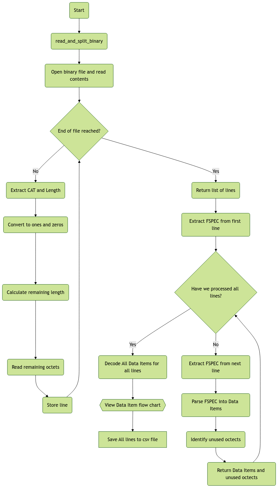

# AsterixProject

## First time installing Project
1. Clone repo: `git clone https://github.com/Robertguarneros/AsterixProject.git`
2. Change into the project directory 
3. Install the dependencies: `pip install -r requirements.txt`
4. Run proyect

## Project Structure

The source code of the project is organized as follows:

- `assets`: contains logo and images used.
- `App.py`: entry point of the app, also where all the GUI menu elements and functions are defined.
 

## Tools Used

We are also using the following tools:
- `isort`: to order imports alphabetically, use with `isort .`
- `black`: formatter, use with `black .`
- `flake8`: linting tool, use with `flake8 .`

## Requirements
To generate requirement list use:
`pip freeze > requirements.txt`

### Install Requirements

The requirements can be installed from the requirements.txt file:
`pip install -r requirements.txt`

### Verify Requirements
`pip list`

## To create Executable
- List dependencies with `pip install -r requirements.txt`
- `pip install pyinstaller`
- `pyinstaller --onefile --noconsole --add-data "map.html;." --add-data "UserManual.pdf" --add-data "assets;assets" App.py`
- The executable will be generated in the `dist` directory.

## Code Structure
For the conversion we use the following structure to transform from the Asterix Binary File to the csv file:

For the decoding of each data item:
[![](https://mermaid.ink/img/pako:eNqFl19vozgUxb-KxVNWSiv8B0LysKtuOrtbaVq1TSbSrvLiASexluDION1m0nz3dbAL2CCmDykB33NO4Me9cA5SkbFgFmxy8V-6o1KBr6_rAui_19GzFCkrS3BPFQUPiu1_sUfAzc2v4OX80DoEQhiCZ8lKVqjfLmbdS7Xu429Wgo_F6Mu7kjRVYHE3B7TIwOLB_KdZBpQA88UK5Lxg1mNxrV06Ok_iAyxdU0g6psva9AN8q02XfM-A2OjS04Dpt6p25QhdXVfeT0Ud11XLdQUbWyq3TIFXdhD6zN6zMpX8oIRsZ0jLt3aGFTQhkCNcpUBejO6PX6F2DlzneGS0PEqWgWdRCsVFAXiht3M6mASbJMTVrqIQL8qkG4W0o0RNFM0bwHemeMA8Muaxq1aZx575tGset80ntfkfX4csJ8YycTUqy8TjDnctk7bltLZ8pZk-y8-5UGCu7y-9i0leKp6WQ1GmJgoMXfEqCwzdMKgHR30ztoFsiLzjMpV0ozeyTF5v7iESoQmBPFGTwqMR9dAIHRwh7qZ4yPR6vuEpragcCmNphMQTN2k8IFHUk8YhEnpILsDj7z-FEloqYTyaCynZZ_Ec8A0o2LVbUnmqV8d29aRevcn5dqdAzt5Y3l9jIYSJrinemG4b5j6dCyEzXlClu-m1c-lWzUpOi_aBWiSxItNapHf9VehPppt8oSRPe5UsiCislfoLrFSmPXqFUGiF4EiT1yxNXQn_hKPPbojci6h3eHdkDLvNsIXfCjX0LfXnv-DpuP_Omv6XXaX6EljuEPFUNXd6p9-SUTeFgx1qsOu_JAP0IUsfij1pMx28tojCnvHg9EXUNMYVy0XK1WnQ3qKJEk_N2PstsmckIKdHoql3RRaKquPwGbA44tBTrCJgvzF2H0n0GmdCahrTVBwLfWfqqVweaNpMP4seRl6p8fKHcc9EwO40xgNeFjJMvFLj5VOW9Hg5lOFowMtShGOv1Hh5FMEeirBDEZ4MeFlkcAK8WmPmM9N3wRxmcMPMX4xv1a55tPl-AvjejtuhhxqLEAk9A_Nc4yEEe2YrcRAiLkKL9s8nFiGCvFLj5U_QHoSIgxBpetjPJhX5fHgjnpKxrohSO379YCCnpaqqG18HJxKdz1_eubr4h41YPHpi7_rFoW1vLvNLMA72TO4pz_Q7xvl6cB1oxz1bBzO9qc8YK9U6WBcXvZIelVicijSYKXlk40CK43YXzDY0L_W340G3aHbP6VbSfb2XZVw_Tz-al5jqXWYcHGjxjxD7Txn9NZidg_dgdjPRbym3MIxInEyicXAKZiiJbhGZTlCECZxM4-llHPyoipPbcJKQOEySGOEITaPL_9tx7V4?type=png)](https://mermaid.live/edit#pako:eNqFl19vozgUxb-KxVNWSiv8B0LysKtuOrtbaVq1TSbSrvLiASexluDION1m0nz3dbAL2CCmDykB33NO4Me9cA5SkbFgFmxy8V-6o1KBr6_rAui_19GzFCkrS3BPFQUPiu1_sUfAzc2v4OX80DoEQhiCZ8lKVqjfLmbdS7Xu429Wgo_F6Mu7kjRVYHE3B7TIwOLB_KdZBpQA88UK5Lxg1mNxrV06Ok_iAyxdU0g6psva9AN8q02XfM-A2OjS04Dpt6p25QhdXVfeT0Ud11XLdQUbWyq3TIFXdhD6zN6zMpX8oIRsZ0jLt3aGFTQhkCNcpUBejO6PX6F2DlzneGS0PEqWgWdRCsVFAXiht3M6mASbJMTVrqIQL8qkG4W0o0RNFM0bwHemeMA8Muaxq1aZx575tGset80ntfkfX4csJ8YycTUqy8TjDnctk7bltLZ8pZk-y8-5UGCu7y-9i0leKp6WQ1GmJgoMXfEqCwzdMKgHR30ztoFsiLzjMpV0ozeyTF5v7iESoQmBPFGTwqMR9dAIHRwh7qZ4yPR6vuEpragcCmNphMQTN2k8IFHUk8YhEnpILsDj7z-FEloqYTyaCynZZ_Ec8A0o2LVbUnmqV8d29aRevcn5dqdAzt5Y3l9jIYSJrinemG4b5j6dCyEzXlClu-m1c-lWzUpOi_aBWiSxItNapHf9VehPppt8oSRPe5UsiCislfoLrFSmPXqFUGiF4EiT1yxNXQn_hKPPbojci6h3eHdkDLvNsIXfCjX0LfXnv-DpuP_Omv6XXaX6EljuEPFUNXd6p9-SUTeFgx1qsOu_JAP0IUsfij1pMx28tojCnvHg9EXUNMYVy0XK1WnQ3qKJEk_N2PstsmckIKdHoql3RRaKquPwGbA44tBTrCJgvzF2H0n0GmdCahrTVBwLfWfqqVweaNpMP4seRl6p8fKHcc9EwO40xgNeFjJMvFLj5VOW9Hg5lOFowMtShGOv1Hh5FMEeirBDEZ4MeFlkcAK8WmPmM9N3wRxmcMPMX4xv1a55tPl-AvjejtuhhxqLEAk9A_Nc4yEEe2YrcRAiLkKL9s8nFiGCvFLj5U_QHoSIgxBpetjPJhX5fHgjnpKxrohSO379YCCnpaqqG18HJxKdz1_eubr4h41YPHpi7_rFoW1vLvNLMA72TO4pz_Q7xvl6cB1oxz1bBzO9qc8YK9U6WBcXvZIelVicijSYKXlk40CK43YXzDY0L_W340G3aHbP6VbSfb2XZVw_Tz-al5jqXWYcHGjxjxD7Txn9NZidg_dgdjPRbym3MIxInEyicXAKZiiJbhGZTlCECZxM4-llHPyoipPbcJKQOEySGOEITaPL_9tx7V4)